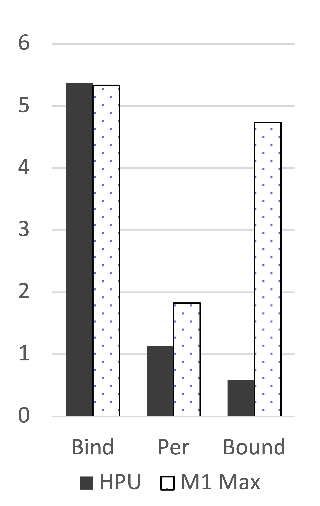
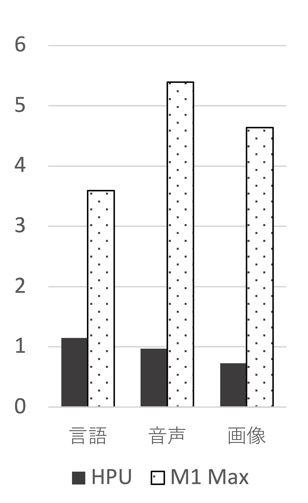
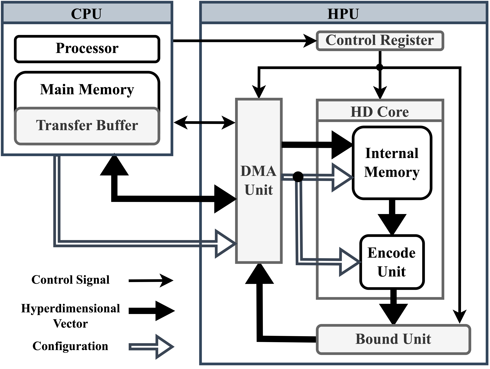
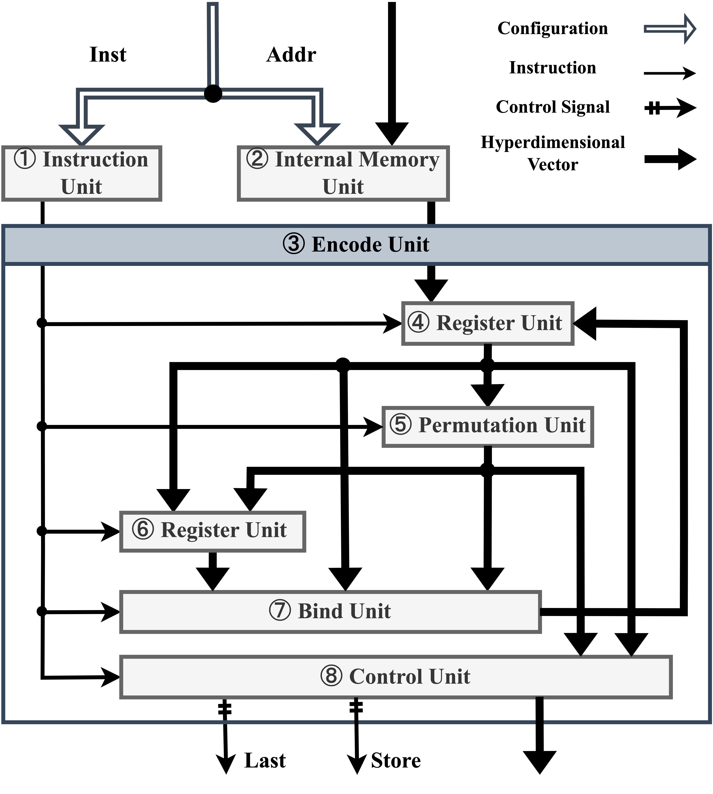

# HPU (Hyperdimensional Processing Unit)

HPU is a programmable accelerator that enhance "Hyperdimensional Computing (HDC)" performance by cooperating with CPU to execute operations at high speed and low power consumption.

## 🐞 Overview

HDC is an efficient technique for performing various cognitive tasks by mapping data to hyperdimensional vectors consisting of thousands to tens of thousands of dimensions. However, the main operations of HDC - Bind, Permutation, and Bound - require several cycles in the computing unit, making it inefficient to perform HDC on a CPU platform. To address this, we propose the Hyperdimensional Processing Unit (HPU), a programmable accelerator specialized for HDC. By cooperating with the CPU, HDC can execute various tasks at high speed and with low power consumption. Our accelerator enables support for any HDC encoding method by allowing the selection of three operations per cycle. Evaluation experiments with the ARM-v7 processor (Cortex-A9) show that HDC operations can be accelerated by a maximum of 169 times, and this accelerator can improve the energy-delay product up to 13,469 times in the training of handwritten character recognition task (MNIST). (The data in the README is based on the "pynq branch" code.)

This project has been selected for [2022 IPA Mito Project](https://www.ipa.go.jp/jinzai/mitou/it/2022/gaiyou_tk-4.html).

## 🪳 HPU Speed

- The figure on the left shows the comparison of computation time (in seconds) for the three main operations of HDC (Bind, Permutation, and Bound) when executed on HPU and M1 Max. 10 cores are used in M1 Max, which uses its own library. Note that the unit of the vertical axis is seconds, and the time to generate random test data for the program is omitted.

- The figure on the right shows a comparison of the computation time (in seconds) when training three different recognition tasks using HDC was executed with HPU and with M1 Max. From left to right: "language recognition" "speech recognition" and "image recognition (MNIST)". 10 cores are used on M1 Max, which uses its own library. The unit of the vertical axis is seconds, and the time to read training data from a file is omitted.

  

## 🐝 HPU Energy-Delay Product (EDP)

| Environment  | language | speech | image (MNIST)
|-------------------------------|----------|----------|--------
| HPU          | 0.2  | 0.3   | 28.5
| M1 Max           | 35.1   | 113.8    | 15343.1
| Cortex-A9  | 1525.0   | 2519.3    | 383887.1

## 🐛 HPU Architecture

- The figure on the left is a schematic of the HPU, a programmable hardware accelerator that performs HDC at high speed and low power consumption.
The HPU consists of "control registers," "DMA unit," "HD core," and "Bound unit," and operates in cooperation with the CPU.

- The figure on the right shows an overview of the HD core, which is the unit responsible for encoding processes such as Bind and Permutation.

  

## 🕷 Details

<ins>**WORK IN PROGRESS**</ins>

I am currently expanding the documentation and providing more comprehensive instructions on the use of the HPU and its associated codes.

If you find value in the HPU that I've developed, your star would mean a lot to me. Each star is a source of encouragement, motivating me to continue developing this project!

## 🐜 Upcoming HPU Announcement

I am developing a new platform that has a different architecture from this repository. 
The new HDC platform under development is an extension based on a Coarse-Grained Reconfigurable Array (CGRA).
